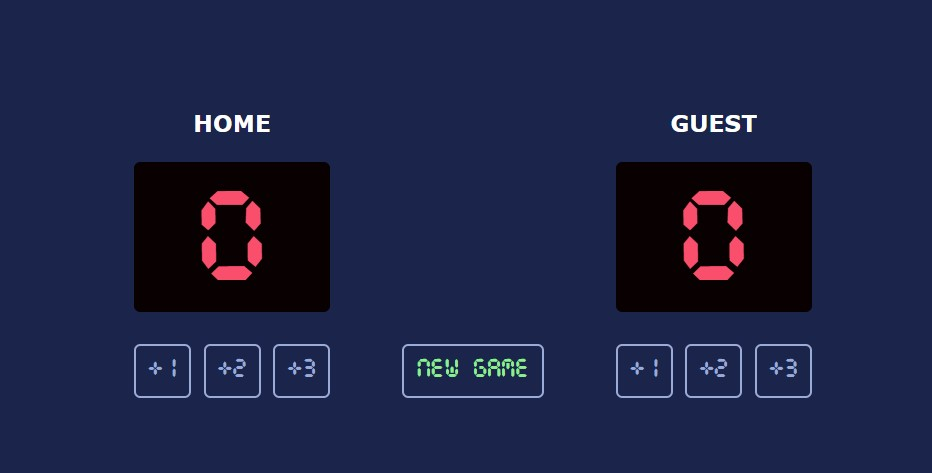

# Basketball Scoreboard

A simple web-based basketball scoreboard that lets you keep track of scores for two teams: **Home** and **Guest**. You can increment each team's score by 1, 2, or 3 points and reset the game at any time.

## Features

- Track scores for Home and Guest teams
- Add 1, 2, or 3 points to either team
- "New Game" button resets both scores to zero
- Clean, retro-inspired design with a custom digital font

## Demo

  
_(Add your own screenshot if desired)_

## Getting Started

### Prerequisites

- A modern web browser (Chrome, Firefox, Edge, etc.)

### Installation

1. **Clone or download this repository.**
2. Make sure the following files are in the same directory:
   - `index.html`
   - `index.css`
   - `index.js`
   - `CursedTimerUlil-Aznm.ttf` (font file)
3. Open `index.html` in your browser.

## File Structure

```
Basketball-scoreboard/
│
├── index.html
├── index.css
├── index.js
└── CursedTimerUlil-Aznm.ttf
```

## Usage

- Click the **+1**, **+2**, or **+3** buttons under each team to add points.
- Click **New Game** to reset both scores to zero.

## Customization

- You can change team names by editing the `<h3>` elements in `index.html`.
- To use a different font, update the `@font-face` rule in `index.css`.

## Notes

- Each button uses a unique `id` and `onclick` handler for clarity.
- The scoreboard is responsive and centered on the page.

## License

This project is for educational and personal use.  
Font: [Cursed Timer ULiL](https://www.dafont.com/cursed-timer-ulil.font) (check font license before distribution).

---
